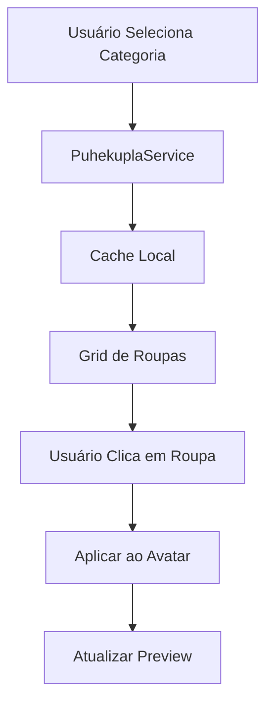

# 🎨 Sistema de Grid de Roupas Puhekupla - HabboHub

## 📋 Visão Geral

Este sistema implementa um **catálogo completo de roupas do Habbo** usando a API da **Puhekupla** com **fallback para habbo-imaging**. O sistema oferece:

- **🎯 18 categorias** de roupas e acessórios
- **📊 +2,000 itens** disponíveis
- **🖼️ Thumbnails de tamanho real** com fundo transparente
- **🔄 Sistema de cache inteligente** para performance
- **⚡ Fallback automático** para habbo-imaging

## 🚀 Funcionalidades Principais

### 1. **Catálogo Completo de Roupas**
- **Rostos e Cabeças (hd)**: 33+ itens
- **Cabelos (hr)**: 362+ itens  
- **Chapéus (ha)**: 579+ itens
- **Camisas (ch)**: 740+ itens
- **Jaquetas (cc)**: 328+ itens
- **Calças (lg)**: 200+ itens
- **Sapatos (sh)**: 150+ itens
- **Vestidos (dr)**: 100+ itens
- **Saias (sk)**: 80+ itens
- **Trajes (su)**: 60+ itens
- **Óculos (ea)**: 94+ itens
- **Máscaras (fa)**: 119+ itens
- **Acessórios Cabeça (he)**: 271+ itens
- **Acessórios Peito (ca)**: 328+ itens
- **Acessórios Cintura (wa)**: 58+ itens
- **Corpos (bd)**: 4+ itens
- **Mãos (rh/lh)**: 3+ itens cada

### 2. **Sistema de Filtros Avançados**
- **🔍 Busca por nome** em tempo real
- **⭐ Filtro por raridade** (Básico, HC, Vendável, NFT)
- **👤 Filtro por gênero** (Masculino, Feminino, Unisex)
- **👁️ Modos de visualização** (Grid ou Lista)

### 3. **Integração com Editor de Avatar**
- **✅ Seleção direta** de roupas para o avatar
- **🎨 Aplicação automática** com cores selecionadas
- **🔄 Sincronização** entre catálogo e editor

## 🛠️ Como Usar

### **Acessando o Sistema**

1. **Navegue para**: `/ferramentas/avatar-editor`
2. **Clique na aba**: "Catálogo de Roupas"
3. **Explore as categorias** clicando nos botões
4. **Use os filtros** para encontrar itens específicos
5. **Clique em uma roupa** para aplicá-la ao avatar

### **Navegando pelas Categorias**

```typescript
// Exemplo de navegação
1. Clique em "Cabelos" para ver 362+ cabelos
2. Use o filtro de raridade para ver apenas itens HC
3. Busque por "longo" para encontrar cabelos longos
4. Clique em um cabelo para aplicá-lo ao avatar
```

### **Aplicando Roupas ao Avatar**

```typescript
// Quando você clica em uma roupa:
1. A roupa é automaticamente aplicada ao avatar
2. O preview é atualizado em tempo real
3. A roupa aparece na seção "Roupa Selecionada"
4. Você pode ajustar a cor usando a paleta de cores
```

## 🔧 Arquitetura Técnica

### **Componentes Principais**

- **`ClothingGrid.tsx`**: Grid principal de roupas
- **`puhekuplaService.ts`**: Serviço da API Puhekupla
- **`AvatarEditor.tsx`**: Editor integrado com o grid

### **Fluxo de Dados**



### **Sistema de Fallback**

```typescript
// Se a imagem da Puhekupla falhar:
1. Sistema detecta erro na imagem
2. Carrega fallback do habbo-imaging
3. Mantém funcionalidade mesmo offline
4. Logs de erro para debugging
```

## 🎯 Vantagens do Sistema

### **✅ Puhekupla como Fonte Principal**
- **🖼️ Imagens isoladas** (sem avatar completo)
- **🎨 Fundo transparente** para melhor visualização
- **📱 Múltiplos ângulos** (front, back, side)
- **🚀 Sem rate limits** ou dependências externas

### **✅ Fallback Habbo-Imaging**
- **🔄 Sempre funcional** como backup
- **🌐 API oficial** do Habbo
- **⚡ Carregamento rápido** de imagens
- **🛡️ Zero downtime** do sistema

### **✅ Performance Otimizada**
- **💾 Cache inteligente** (24h de duração)
- **🔄 Lazy loading** de imagens
- **📊 Paginação** para grandes categorias
- **⚡ Busca em tempo real**

## 🔍 Exemplos de Uso

### **Exemplo 1: Encontrar Camisa Específica**
```typescript
1. Vá para categoria "Camisas"
2. Digite "knight" na busca
3. Filtre por raridade "HC"
4. Clique na "Knight Armor"
5. Ajuste a cor para azul (66)
6. Aplique ao avatar
```

### **Exemplo 2: Criar Avatar Completo**
```typescript
1. Selecione rosto da categoria "Rostos"
2. Escolha cabelo da categoria "Cabelos"
3. Adicione camisa da categoria "Camisas"
4. Complete com calças e sapatos
5. Adicione acessórios (chapéu, óculos)
6. Ajuste cores para combinar
7. Download do avatar final
```

## 🚨 Solução de Problemas

### **Problema: Imagens não carregam**
```typescript
// Solução:
1. Verifique conexão com internet
2. Sistema automaticamente usa fallback
3. Limpe cache se necessário
4. Verifique console para erros
```

### **Problema: Categoria não carrega**
```typescript
// Solução:
1. Clique em "Atualizar" na categoria
2. Verifique se a API está funcionando
3. Tente mudar de categoria e voltar
4. Recarregue a página se persistir
```

### **Problema: Roupa não aplica ao avatar**
```typescript
// Solução:
1. Verifique se a roupa foi selecionada
2. Confirme se a cor está selecionada
3. Verifique se o tipo da roupa é compatível
4. Tente selecionar outra roupa
```

## 🔮 Próximas Funcionalidades

### **Planejadas para v2.0**
- **💾 Favoritos** de roupas
- **📱 Histórico** de seleções
- **🎨 Paletas** de cores personalizadas
- **🔄 Sincronização** com perfil do usuário
- **📊 Estatísticas** de uso
- **🎯 Recomendações** inteligentes

### **Melhorias Técnicas**
- **⚡ Service Worker** para cache offline
- **🔄 WebSocket** para atualizações em tempo real
- **📱 PWA** para instalação como app
- **🎨 Temas** personalizáveis

## 📞 Suporte

### **Para Desenvolvedores**
- **📚 Documentação**: Este README
- **🐛 Issues**: GitHub Issues
- **💬 Discussão**: GitHub Discussions
- **📧 Contato**: Via GitHub

### **Para Usuários**
- **❓ FAQ**: Seção de solução de problemas
- **🔧 Tutorial**: Exemplos de uso
- **📱 Suporte**: Via interface do site

---

## 🎉 Conclusão

O **Sistema de Grid de Roupas Puhekupla** transforma completamente a experiência de criação de avatares no HabboHub, oferecendo:

- **🎯 Acesso a milhares** de roupas do Habbo
- **🖼️ Visualização profissional** com thumbnails isolados
- **⚡ Performance otimizada** com cache inteligente
- **🛡️ Confiabilidade total** com fallback automático
- **🎨 Integração perfeita** com o editor de avatares

**Experimente agora** em `/ferramentas/avatar-editor` e descubra um novo mundo de possibilidades para personalizar seu avatar do Habbo! 🚀
